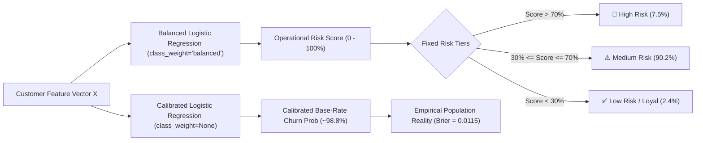

# Brazilian E-Commerce (Olist) Customer Churn Prediction & Risk Scoring System

A professional, production-grade Machine Learning and Decision Support system built on the **Brazilian E-Commerce Public Dataset by Olist** (Kaggle). This project demonstrates relational data engineering, leakage-safe historical snapshotting, severe class imbalance mitigation, dual risk scoring architecture, probability calibration, and an interactive Streamlit dashboard.

---

## 📌 Executive Summary & Key Results

| Cohort / Metric | Empirical Value | Context & Significance |
| :--- | :--- | :--- |
| **Total Customer Universe** | **96,096** | Unique individuals across entire Olist database |
| **Delivered Customers** | **93,358** | Customers with valid, completed deliveries |
| **One-Time Buyers (Baseline)** | **90,557 (97.00%)** | E-commerce marketplace non-contractual reality |
| **Repeat Buyers (Baseline)** | **2,801 (3.00%)** | Customers with > 1 lifetime order |
| **Eligible Customer Cohort ($N$)** | **55,525** | Customers with valid orders $\le$ 2018-02-28 |
| **Actual Churned Customers (1)** | **54,872 (98.82%)** | No completed order in 180-day target window |
| **Actual Active Customers (0)** | **653 (1.18%)** | $\ge 1$ completed order in 180-day target window |
| **Discrimination (ROC-AUC)** | **0.6035** | Tested on held-out 20% stratified test set |
| **Minority Active PR-AUC** | **0.0312** | **2.65x Relative Lift** over the 1.18% random baseline |
| **Majority Churn PR-AUC** | **0.9918** | Evaluated against 0.9882 prevalence baseline |
| **Probability Calibration** | **Brier: 0.011557** | ECE: 0.000278 (empirically well-calibrated) |

---

## 🔬 Methodological Architecture (Locked Specifications)

### 1. Snapshot Date & Target Window
- **Snapshot Date:** `2018-02-28 23:59:59`
  - Provides **14 months** of mature operational history (Jan 2017 – Feb 2018) for historical feature extraction.
- **Target Window:** **180 days** (`2018-03-01 00:00:00` through `2018-08-27 23:59:59`)
  - A standard 6-month non-contractual retail repurchase evaluation horizon.
  - Olist logging ends abruptly after August 29, 2018; `2018-08-27` is the latest possible 180-day cutoff that avoids right-censoring artifacts.

### 2. Exact Target Definition
> *"A customer is classified as active (`churn = 0`) if they placed at least one valid delivered/completed order whose `order_purchase_timestamp` falls within the 180-day target window. The purchase timestamp determines target-window membership; delivery may occur after the window endpoint. If no such order is placed, `churn = 1`."*

### 3. Customer Identity Resolution
Transactions are keyed on `customer_unique_id` (the true consumer identifier), **not** `customer_id` (a per-order checkout token).

---

## 🛡️ Target Leakage Prevention & Audit Findings

Target leakage invalidates churn models in production. We established strict boundary audits:
1. **Timestamp Boundary:** All order and item aggregations strictly enforce `order_purchase_timestamp <= 2018-02-28 23:59:59`.
2. **Review Feedback Leakage:**
   - Empirical investigation revealed **4,034 customer reviews** created *after* February 28, 2018 for orders placed *before* the cutoff.
   - The feature pipeline strictly filters `review_creation_date <= 2018-02-28 23:59:59`. Customers with reviews pending at snapshot are assigned cohort median scores and flagged with `has_review_at_snapshot = 0`.
3. **Logistics & Delivery Delay Leakage:**
   - Orders placed in late February whose delivery was completed in March do not leak future transit times.
   - Delay metrics (`avg_delivery_delay_days`, `late_delivery_rate`) are computed strictly on deliveries completed on or before February 28, with pending orders tracked via `pending_delivery_at_snapshot = 1`.
4. **Data Preprocessing Safeguards:**
   - All standardizers (`StandardScaler`) and encoders (`OneHotEncoder`) are fitted **exclusively on the training split** (80%) and transformed on validation/test splits.

---

## ⚖️ Dual Risk Scoring Architecture: Probability vs. Operational Score

Under a **98.82% population churn prevalence**, standard calibrated models produce probabilities concentrated between $95\%$ and $99.9\%$. If fixed thresholds ($>70\%$, $30\%-70\%$, $<30\%$) were applied directly to calibrated probabilities, **$99.98\%$ of customers would fall into High Risk**, destroying operational decision utility.

To resolve this without altering business rules, our architecture deploys two complementary metrics:



### 1. Operational Risk Score ($S_{\text{risk}} \in [0, 1]$)
- Produced by Logistic Regression with `class_weight='balanced'`.
- Minorities are upweighted ($w_0 \approx 42.5$, $w_1 \approx 0.506$), shifting the effective prior to $50/50$ and adjusting the intercept by $\ln(N_1 / N_0) \approx +4.431$.
- Expands dynamic contrast across the $0–100\%$ range, allowing meaningful separation into the required fixed tiers:
  - **High Risk ($> 70\%$):** $4,162$ customers ($7.50\%$)
  - **Medium Risk ($30\% - 70\%$):** $50,057$ customers ($90.15\%$)
  - **Low Risk ($< 30\%$):** $1,306$ customers ($2.35\%$)

### 2. Calibrated Base-Rate Churn Probability ($P_{\text{calibrated}} \in [0.95, 0.999]$)
- Preserves the empirical population log-loss and base-rate prevalence.
- Evaluated on held-out test data with a **Brier Score of 0.011557** and **Expected Calibration Error of 0.000278**.

---

## 📈 Model Performance & Evaluation Metrics

Evaluated on a held-out, stratified $20\%$ test set ($N = 11,105$ customers: $10,974$ churned, $131$ active):

### 1. Dual Precision-Recall Analysis
- **Majority Class (`churn = 1`):**
  - **PR-AUC:** **0.9918** (vs. baseline prevalence of **0.9882**).
  - *Key Takeaway:* PR-AUC on the majority class appears high because random guessing achieves $0.9882$.
- **Minority Class (`active = 0`):**
  - **PR-AUC:** **0.0312** (vs. baseline prevalence of **0.0118**).
  - *Key Takeaway:* Represents a **2.65x Lift** in precision over unguided CRM targeting.

### 2. Decile Lift Table (Active Propensity Ranking)
By targeting customers ranked in the top decile of retention propensity (Decile 1), the business captures **$22.9\%$ of all repeat buyers** from just $10\%$ of customer outreach.

| Decile | Customers | Actual Active | Active Rate | Cum Active Capture | Decile Lift |
| :--- | :--- | :--- | :--- | :--- | :--- |
| **D1** | 1,111 | 30 | 2.700% | 22.9% | **2.29x** |
| **D2** | 1,110 | 21 | 1.892% | 38.9% | **1.60x** |
| **D3** | 1,111 | 18 | 1.620% | 52.7% | **1.37x** |
| **D4** | 1,110 | 14 | 1.261% | 63.4% | **1.07x** |
| **D5 - D10** | 6,663 | 48 | 0.720% | 100.0% | < 1.0x |

---

## 🔍 Model Interpretability & Odds Ratios ($\exp(\beta)$)

Logistic Regression log-odds coefficients reveal the behavioral mechanisms driving churn:

```
Recency (Days Inactive)       [OR: 2.085]  ████████████████████ +108.5% Churn Odds
Customer State (Other)        [OR: 1.421]  ████████ +42.1%
Avg Order Value               [OR: 1.379]  ███████ +37.9%
Avg Item Price                [OR: 1.309]  ██████ +30.9%
Customer State (SP)           [OR: 0.825]  ░░░░░░ -17.5%
Avg Review Score              [OR: 0.790]  ░░░░░░░ -21.0%
Total Spend                   [OR: 0.707]  ░░░░░░░░░ -29.3%
Customer Tenure (Days)        [OR: 0.585]  ░░░░░░░░░░░░░ -41.5%
```

- **Inactivity is Fatal:** Every standard deviation increase in `recency_days` more than doubles churn odds ($\text{OR} = 2.085$).
- **Tenure Protects Loyalty:** Established relationships significantly reduce churn ($\text{OR} = 0.585$).
- **Customer Satisfaction Counts:** Each unit increase in review score reduces churn odds by $21\%$ ($\text{OR} = 0.790$).

---

## 🖥️ Streamlit Decision Support Application

The interactive web dashboard includes 4 operational views:
1. **Executive Overview & Risk Tiers:** High-level KPIs, cohort summaries, and tier breakdowns.
2. **Model Evaluation & Dual PR-AUC Laboratory:** Interactive ROC curves, PR curves with baseline benchmarks, confusion matrices, and decile lift charts.
3. **Feature Drivers & Interpretability:** Horizontal odds ratio charts with behavioral explanations.
4. **Customer Risk Explorer & Action Center:** Searchable customer database, risk gauge meters, and **one-click High-Risk CSV export** for CRM campaigns.

---

## 📁 Repository Structure

```
customer-churn-olist-final/
├── data/
│   ├── raw/                         # Raw Olist CSV files
│   └── processed/                   # Generated snapshot feature store & targets
├── src/
│   ├── __init__.py
│   ├── config.py                    # Locked constants, paths, and date cutoffs
│   ├── data_loader.py               # Data loading, datetime parsing & relational keys
│   ├── target_builder.py            # Churn target generation (55,525 eligible cohort)
│   ├── feature_engineering.py       # Leakage-free RFM, reviews, logistics & payments
│   ├── model.py                     # Logistic Regression training & calibration
│   ├── evaluation.py                # ROC-AUC, Brier score, Dual PR-AUC & Decile Lift
│   ├── risk_scoring.py              # Risk tiers (High >70%, Med 30-70%, Low <30%) & CSV export
│   └── train_pipeline.py            # End-to-end training orchestrator
├── tests/
│   ├── __init__.py
│   ├── test_data_leakage.py         # Automated timestamp leakage audit
│   ├── test_target_consistency.py   # Verify cohort counts (54,872 churn, 653 active)
│   └── test_model_pipeline.py       # Check scoring bounds, tiers & exports
├── app/
│   └── app.py                       # Multi-tab Streamlit dashboard
├── artifacts/
│   ├── model_pipeline.joblib        # Serialized models and feature importances
│   ├── metrics.json                 # Comprehensive test metrics
│   ├── scored_customers.parquet     # Full scored customer database
│   └── high_risk_customers.csv      # Exported High-Risk CRM campaign list
├── requirements.txt                 # Project dependencies
└── README.md                        # Project documentation
```

---

## 🚀 Execution & Quickstart Guide

### 1. Environment Setup
```bash
# Clone or navigate to the project directory
cd customer-churn-olist-final

# Install dependencies
pip install -r requirements.txt
```

### 2. Run End-to-End Pipeline
Executes data validation, leakage-safe feature engineering, model training, evaluation, scoring, and exports:
```bash
python -m src.train_pipeline
```

### 3. Run Automated Tests
```bash
python -m unittest discover tests
```
*Executes all 14 unit tests validating data leakage, target consistency, scoring bounds, and export integrity.*

### 4. Launch Streamlit Application
```bash
streamlit run app/app.py
```

---

## ⚠️ Commercial Limitations & Methodological Caveats

1. **Non-Contractual Reality:** E-commerce customers do not submit cancellation notices. A 180-day purchase absence is an empirical proxy for churn; customers returning on Day 200 are counted as churned within this horizon.
2. **Structural Market Imbalance:** Olist's 97% one-time purchase rate reflects general marketplace dynamics for durable items (furniture, appliances) rather than operational marketing failure.
3. **Horizon Truncation:** Olist's dataset halts after August 2018, preventing validation across multi-year purchase cycles or seasonality models.
4. **Behavioral Data Boundaries:** Features are strictly transactional (RFM, freight, reviews, logistics). User browsing sessions, search intent, email click-through rates, and app usage logs were not recorded in the original Olist dataset.
